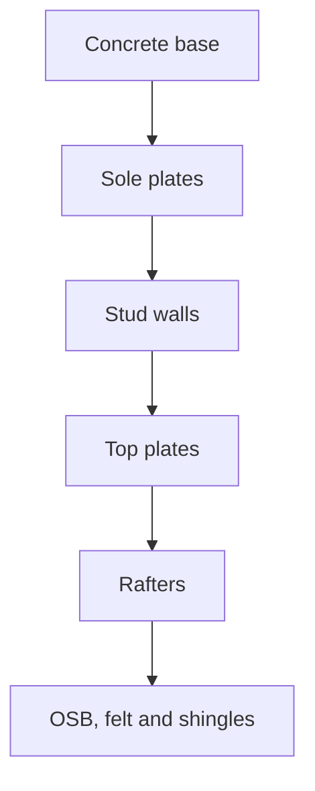
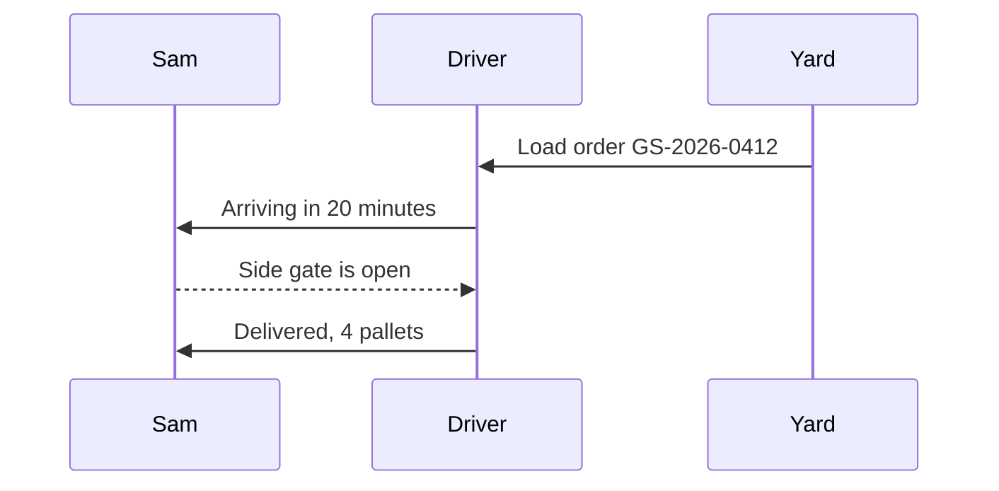
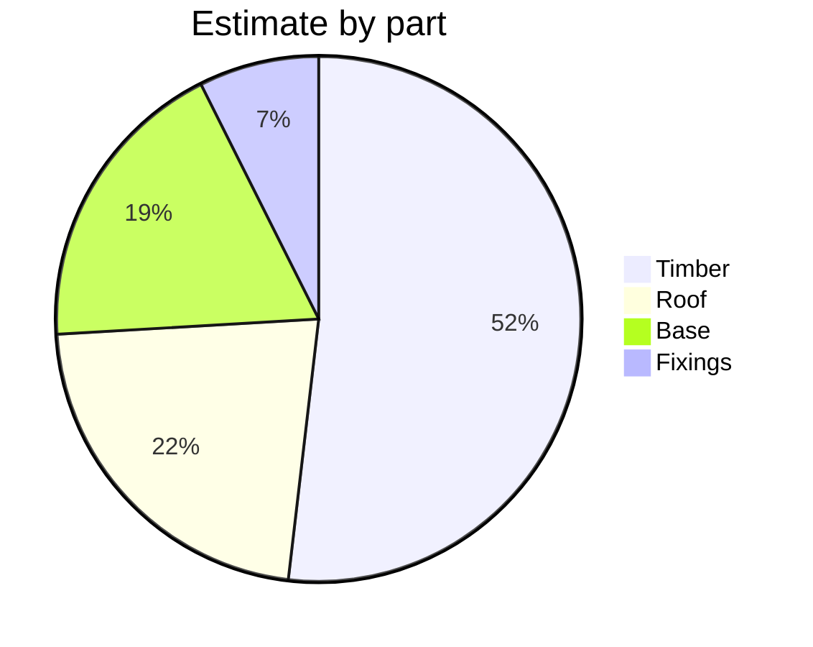

# Frame

How the parts go together:

```mermaid
flowchart TD
  accTitle: Shed frame
  accDescr: The base carries the walls, the walls carry the roof
  Base[Concrete base] --> Sole[Sole plates]
  Sole --> Walls[Stud walls]
  Walls --> Top[Top plates]
  Top --> Rafters
  Rafters --> Roof[OSB, felt and shingles]
```

Who does what on delivery day:

```mermaid
sequenceDiagram
  participant S as Sam
  participant D as Driver
  participant Y as Yard
  Y->>D: Load order GS-2026-0412
  D->>S: Arriving in 20 minutes
  S-->>D: Side gate is open
  D->>S: Delivered, 4 pallets
```

The budget so far:

```mermaid
pie title Estimate by part
  "Timber" : 420
  "Roof" : 180
  "Base" : 150
  "Fixings" : 60
```
