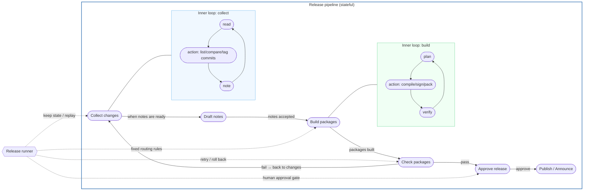
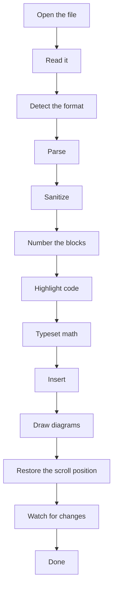

# Diagram sizes

A wide flow: left to right, with nested subgraphs laid out top to bottom, edge labels, dotted links
and a fill set by the author.

```mermaid
flowchart LR
  subgraph PIPE["Release pipeline (stateful)"]
    direction LR
    S1([Collect changes])
    S2([Draft notes])
    S3([Build packages])
    S4([Check packages])
    S5([Approve release])
    S6([Publish / Announce])

    S1 -->|when notes are ready| S2
    S2 -->|notes accepted| S3
    S3 -->|packages built| S4
    S4 -->|pass| S5
    S5 -->|approve| S6
    S4 -->|"fail → back to changes"| S1

    subgraph L1[Inner loop: collect]
      direction TB
      C1([read]) --> C2([action: list/compare/tag commits]) --> C3([note]) --> C1
    end

    subgraph L2[Inner loop: build]
      direction TB
      B1([plan]) --> B2([action: compile/sign/pack]) --> B3([verify]) --> B1
    end

    S1 --- L1
    S3 --- L2
  end

  RT{{Release runner}}
  RT -.->|keep state / replay| S1
  RT -.->|fixed routing rules| S3
  RT -.->|human approval gate| S5
  RT -.->|retry / roll back| S4

  style PIPE fill:#ffffff,stroke:#2b6cb0,stroke-width:2px
  style L1 fill:#f0f8ff,stroke:#63b3ed
  style L2 fill:#f0fff4,stroke:#68d391
```

A tall chain, top to bottom.

```mermaid
flowchart TD
  A[Open the file] --> B[Read it] --> C[Detect the format] --> D[Parse] --> E[Sanitize]
  E --> F[Number the blocks] --> G[Highlight code] --> H[Typeset math] --> I[Insert]
  I --> J[Draw diagrams] --> K[Restore the scroll position] --> L[Watch for changes] --> M[Done]
```
